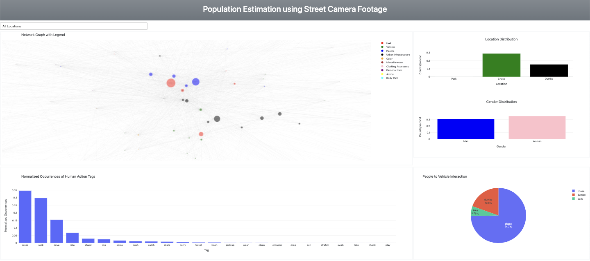

# Population-Estimation-using-Street-Cam-Footage

This paper investigates the characteristics of urban environments using the StreetAware dataset. This dataset comprises synchronized high-resolution video recordings, exceeding 8 hours in total duration, captured from busy intersections in Brooklyn, NY. We aim to gain a comprehensive understanding of object co-occurrence patterns, human action dynamics, and traffic flow within these settings. Leveraging object detection models such as YOLO and RAM, we perform object identification and classification tasks. This allows us to analyze patterns of co-occurrence among objects and explore the relationships between these patterns. Additionally, Human Action Recognition (HAR) techniques are employed to investigate activity levels within the urban environment. The combined analysis of these factors sheds light on urban behavior and demographic variations across the captured locations. To effectively visualize our findings, we have designed a comprehensive dashboard. Key features of this dashboard include a network graph depicting object tag co-occurrence, visualizations of tag distribution across locations and demographics (gender), a bar chart representing the distribution of identified human actions, and a pie chart illustrating the co-occurrence of people and vehicles across the three captured locations. The versatility of this dashboard allows for its application in various domains, including urban planning, traffic management, public safety initiatives, and even commercial applications.

## Dashboard Built for Project

### Visualisation Design for the project
The dashboard integrates visualizations for location-specific and gender-based tag distributions. Adjacent to the network graph, a chart displays the occurrence of each tag across the three locations (Chase, Dumbo, Park). This allows users to identify variations in object presence based on the location. Similarly, another chart depicts the distribution of tags by gender, providing insights into potential demographic patterns associated with specific objects. \n

The lower section of the dashboard presents a bar chart that visualizes the distribution of human actions (HAR) detected within the selected location. This chart allows users to quickly assess the prevalence of various human activities (e.g., walk, drive) at a specific intersection. \n

A pie chart positioned on the bottom right corner of the dashboard highlights the co-occurrence of "people" and "car" tags across the three locations. This visualization helps users understand the frequency with which pedestrians and vehicles share the same space, potentially indicating areas with a higher risk of accidents. \n

The dashboard offers the flexibility to switch between different locations (Overall, Chase, Dumbo, Park) using a designated filter. Selecting a specific location updates the network graph, human action distribution, and location/gender distribution charts accordingly. This allows users to conduct focused analyses and gain detailed insights for each intersection. \n

An additional feature is that all the tags have been grouped into one of these 10 categories so we can even leverage insights as a group rather than individual tags. The categories include Urban Infrastructure, People, Vehicles, Personal Items, etc.

